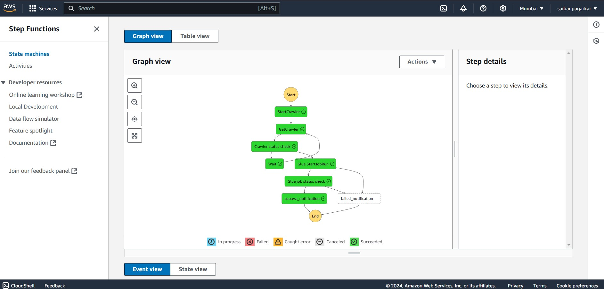
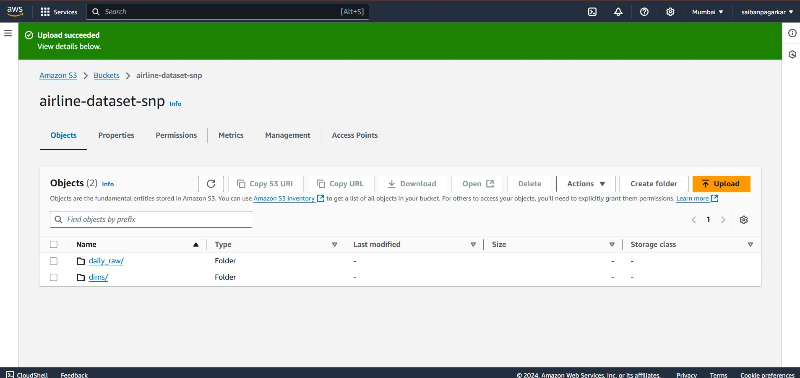
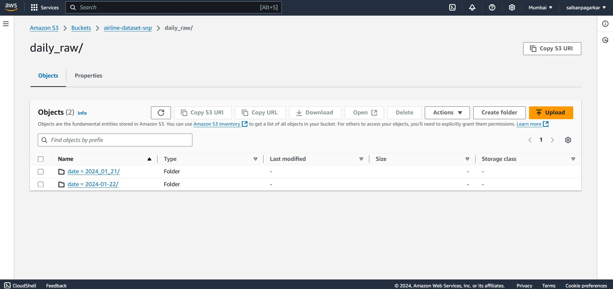
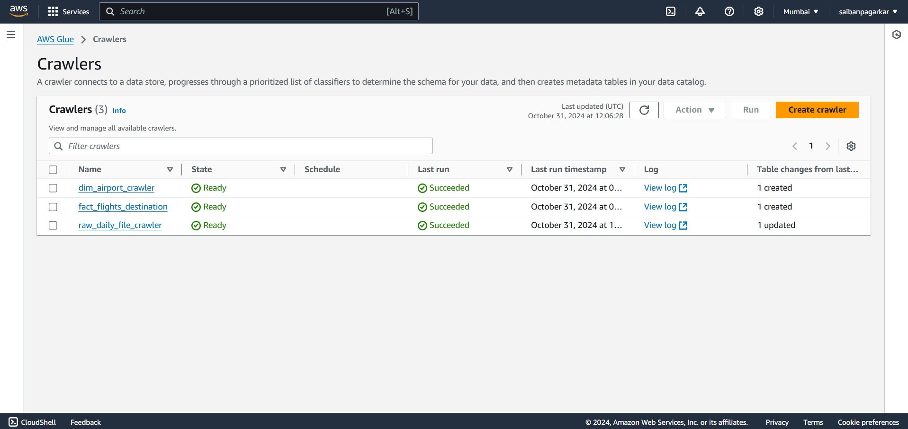
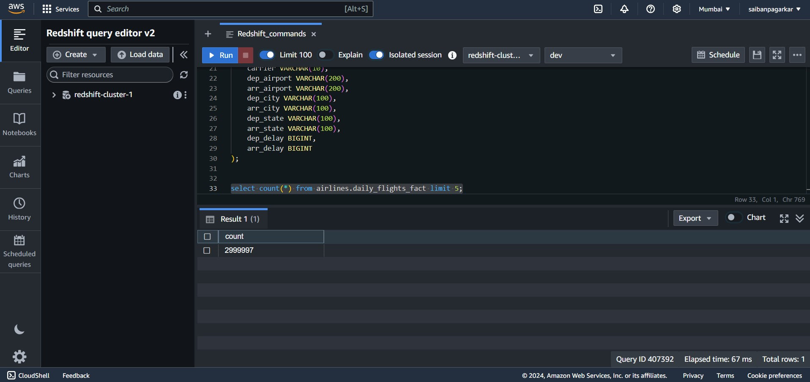
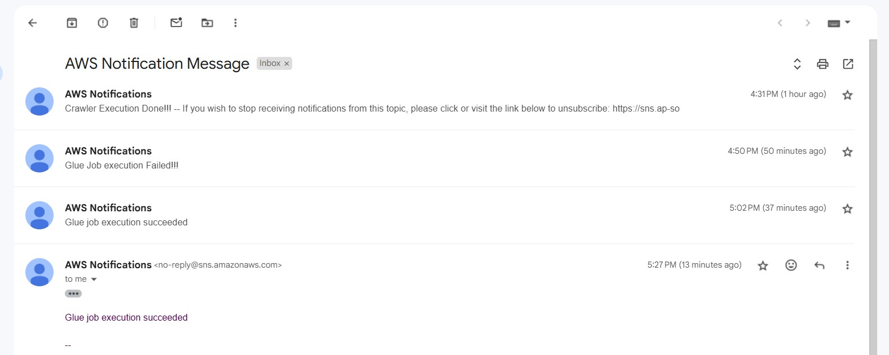

# Airline_Data_Ingestion_Pipeline ✈️✈️✈️

## Project Overview👨‍💻
The **Daily Airline Data Ingestion** project aims to create a scalable, automated data pipeline to ingest daily flight data into an Amazon Redshift fact table. This architecture leverages multiple AWS services to monitor, process, and load data, ensuring an efficient and reliable ingestion process.

## Table of Contents
- [Project Overview](#project-overview)
- [Tech Stack](#tech-stack)
- [Pipeline Steps](#pipeline-steps)
- Images

## Tech Stack
- **AWS S3** - Data storage for raw flight data files.
- **AWS CloudTrail** - Monitors the S3 bucket for new data uploads.
- **AWS EventBridge** - Event-driven architecture to trigger the pipeline.
- **AWS Glue Crawler** - Automatic schema detection for Glue Data Catalog.
- **AWS Glue ETL** - Data cleaning, transformation, and preparation.
- **AWS SNS** - Notification service for ETL job status.
- **AWS Redshift** - Data warehouse for storing processed flight data.
- **AWS Step Functions** - Orchestrates the pipeline from ingestion to loading.

## Pipeline Steps

1. **AWS S3 (Storage Layer)**
   - Stores daily flight data organized by date (`flights/YYYY/MM/DD/`).
   - S3 versioning is enabled to maintain data integrity.

2. **S3 CloudTrail Notification**
   - Monitors the S3 bucket for new uploads.
   - Sends notifications when new data files are uploaded.

3. **AWS EventBridge (Event-Driven Architecture)**
   - Detects CloudTrail events related to S3 uploads.
   - Triggers the next steps in the pipeline upon new data uploads.

4. **AWS Glue Crawler (Metadata Management)**
   - Scans S3 for schema changes and updates the Glue Data Catalog.
   - Ensures the most recent schema is available for the ETL process.

5. **AWS Glue ETL (Data Transformation)**
   - Cleans and transforms raw flight data.
   - Data cleaning (e.g., handling nulls) and transformation (e.g., aggregations) are done here.

6. **AWS SNS (Notification)**
   - Sends notifications upon Glue ETL job completion, indicating success or failure.

7. **AWS Redshift (Data Warehouse)**
   - Stores the processed data in a Redshift fact table.
   - Uses `COPY` commands to ingest data from S3.

8. **AWS Step Functions (Orchestration)**
   - Orchestrates the pipeline from data ingestion to data loading.
   - Includes steps for data detection, ETL, data load, and notifications.

## AWS Stepfunction flow

## AWS S3

## Daily_flight_data

## AWS Glue Crawlers

## AWS Redshift QueryEditor

## Email notification

